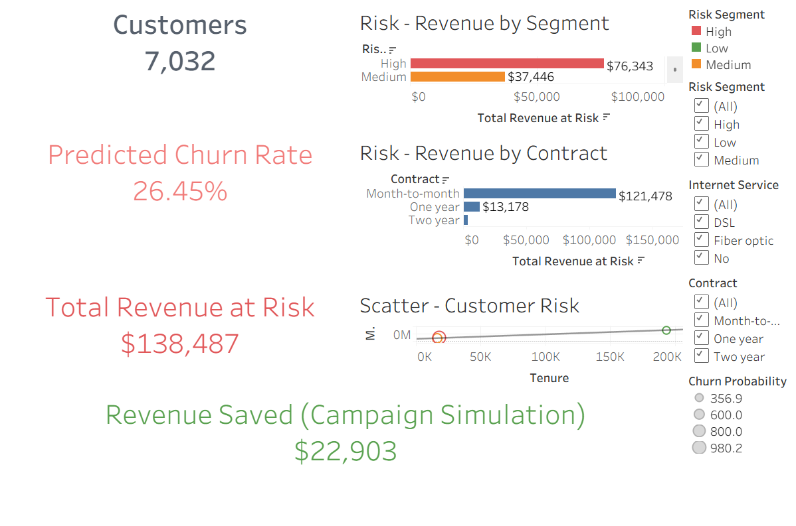

# 📊 Customer Churn Revenue Risk Intelligence Dashboard

## 🔎 Project Overview

This project combines machine learning and business intelligence to predict customer churn and quantify its financial impact.

Instead of stopping at churn probability, this dashboard translates model outputs into:

💰 Total Revenue at Risk

📉 Predicted Churn Rate

🎯 Revenue Recovery Simulation (What-if campaign analysis)

The result is a decision-support tool for retention strategy planning.

## 🎯 Business Problem

Customer churn reduces recurring revenue and increases acquisition costs.

The objectives of this project were to:

Predict which customers are likely to churn

Quantify how much revenue is exposed

Simulate how much revenue could be recovered through retention campaigns

This bridges predictive modeling with financial impact.

## 🧠 Machine Learning Component

## 🎯 Model Objective

Predict probability of customer churn using structured customer data.

## 📌 Features Used

Tenure

Monthly Charges

Contract Type

Internet Service

Online Security / Backup

Tech Support

Payment Method

Senior Citizen

Partner / Dependents

## 📤 Model Outputs

Churn Probability

Predicted Churn Flag

Risk Segment (High / Medium / Low)

## 💰 Revenue Intelligence Layer

## 1️⃣ Revenue at Risk

```bash
Revenue at Risk = Monthly Charges × 12 × Churn Probability
```

This estimates annual revenue exposure per customer and aggregates across the portfolio.

## 2️⃣ Risk Segmentation

Customers are categorized into:

🔴 High Risk

🟠 Medium Risk

🟢 Low Risk

This allows prioritization of retention efforts.

## 3️⃣ 🎯 Campaign Simulation (What-If Analysis)

The dashboard includes a dynamic parameter to simulate retention campaign effectiveness:

```bash
Revenue Saved = Revenue at Risk × Campaign Success Rate
```

Users can adjust the campaign success rate (e.g., 30% → 70%) and instantly see potential recovered revenue.

This transforms a static prediction model into a decision simulation tool.

## 📊 Dashboard Components

## 🧾 KPI Panel

Total Customers

Predicted Churn Rate

Total Revenue at Risk

Revenue Saved (Simulation)

## 📈 Risk Breakdown

Revenue at Risk by Risk Segment

Revenue at Risk by Contract Type

## 🔍 Customer Risk Scatter

Tenure vs Monthly Charges
Colored by Risk Segment
Sized by Churn Probability

This visually validates model behavior and highlights risk concentration patterns.

## 🛠 Tools & Technologies

🐍 Python (Pandas, Scikit-learn)

📓 Jupyter Notebook

📊 Tableau Public

Feature engineering & probability modeling

Business metric translation

## 🚀 Key Insights

Majority of revenue exposure is concentrated in the High-risk segment

Month-to-month contracts contribute disproportionately to churn risk

Even moderate campaign success (50%) can recover significant revenue

## 💡 Why This Project Matters

Many churn projects stop at model accuracy.

This project goes further by:

✔ Connecting ML outputs directly to revenue
✔ Enabling executive-level decision making
✔ Providing scenario simulation capabilities
✔ Demonstrating cross-functional thinking (Data Science + BI)

This reflects real-world analytics maturity beyond predictive modeling. 

## 🔗 Live Dashboard

https://public.tableau.com/app/profile/ege.bakal.m/viz/CustomerChurnRevenueRiskIntelligence/RevenueatRisk-ExecutiveView#1

Ege Bakalım
Data Scientist
linkedin.com/in/egebakalim
github.com/egebakalim


